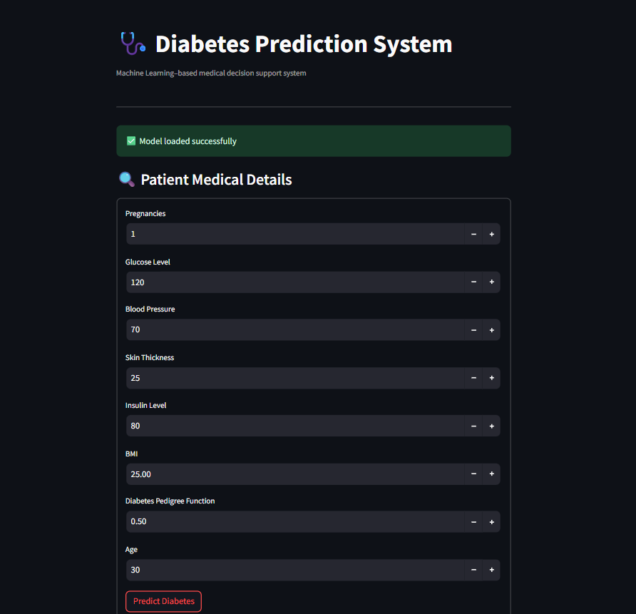

# 🩺 Diabetes Prediction System (Machine Learning)

A machine learning–based system to predict the **risk of diabetes** using patient medical data.  
This project demonstrates a complete **end-to-end ML workflow** including data preprocessing, model training, evaluation, and a simple user interface built with Streamlit.

> ⚠️ This project is for **educational purposes only** and should not be used as a medical diagnosis tool.

---

## 📌 Project Overview

- **Problem Type:** Binary Classification  
- **Target Variable:** `Outcome`  
  - `0` → Non-diabetic  
  - `1` → Diabetic  
- **Dataset:** Pima Indians Diabetes Dataset  
- **Approach:**  
  Data preprocessing → Model training → Evaluation → Prediction interface

---

## 📊 Features Used

| Feature | Description |
|------|------------|
| Pregnancies | Number of pregnancies |
| Glucose | Plasma glucose concentration |
| BloodPressure | Diastolic blood pressure |
| SkinThickness | Triceps skinfold thickness |
| Insulin | Serum insulin level |
| BMI | Body Mass Index |
| DiabetesPedigreeFunction | Genetic risk factor |
| Age | Age of the patient |

---

## 🧠 Machine Learning Workflow

### 1️⃣ Data Preprocessing
- Replaced **invalid zero values** with missing values  
- Applied **median imputation** for missing data  
- Performed **feature scaling** using StandardScaler  
- Used **Pipeline** to prevent data leakage  

---

### 2️⃣ Models Implemented
- Logistic Regression (baseline model)
- K-Nearest Neighbors (bias–variance understanding)
- Support Vector Machine (RBF kernel)
- Random Forest Classifier (final model)

---

### 3️⃣ Model Evaluation
- Accuracy
- ROC-AUC score
- Probability-based prediction

> In healthcare-related ML problems, **probability and recall are more important than raw accuracy**.

---

## 🧪 Example Prediction Output

- **Prediction:** Low Risk of Diabetes  
- **Probability:** 38.33%

This means the model estimates a **38.33% chance** of diabetes for the given patient inputs.

---

## 🖥️ User Interface (Streamlit)

A simple Streamlit-based interface allows users to:
- Enter patient medical details
- Get real-time prediction results
- View diabetes risk probability

The UI is designed to be **clean, minimal, and easy to use**.

---

### 🔹 App Interface Preview

> ⚠️ The prediction clearly shows the estimated probability of diabetes and is intended for educational use only.
